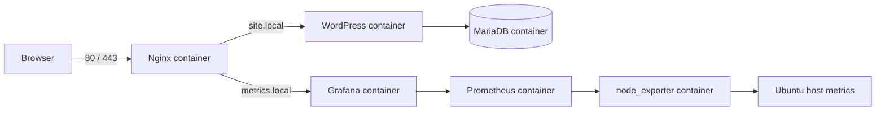

# Architecture

## Goals

The stack must be reproducible, keep service configuration on the host, expose
only the required entry points and be understandable during a technical
interview.

## Design decisions

1. Nginx is the only container that publishes web ports on the host.
2. MariaDB is reachable only from WordPress over an internal Docker network.
3. Prometheus and node_exporter are not published publicly. Grafana is reached
   through Nginx using `metrics.local`.
4. Nginx, Prometheus and Grafana provisioning files are bind-mounted read-only.
5. Database, WordPress and Grafana application data use named Docker volumes.
6. TLS for `site.local` uses a generated self-signed certificate for the test
   environment. The private key is generated during deployment and ignored by
   Git.
7. Access to `/wp-admin/` and `/wp-login.php` is restricted by a configurable
   source CIDR.
8. Fail2ban runs on the Ubuntu host because it protects the host SSH service,
   not an application container.
9. Image versions are pinned after checking the current stable releases in
   official upstream sources. Floating `latest` tags are not used.

## Docker networks

| Network | Members | Purpose |
| --- | --- | --- |
| `edge` | Nginx, WordPress, Grafana | Reverse-proxy traffic |
| `database` | WordPress, MariaDB | Isolated database traffic |
| `monitoring` | Grafana, Prometheus, node_exporter | Metrics collection |

## Acceptance criteria

- `docker compose config` succeeds.
- All containers become healthy or remain stably running.
- HTTP requests to `site.local` redirect to HTTPS.
- HTTPS requests to `site.local` reach WordPress.
- Requests to `metrics.local` reach Grafana.
- Unauthorized addresses cannot reach WordPress administration endpoints.
- Prometheus reports the node_exporter target as `UP`.
- The `OS General` dashboard is provisioned automatically from JSON.
- Fail2ban protects SSH on the host without blocking the deployment workflow.
- Ansible can deploy the stack repeatedly without unnecessary changes.
- CI validates Compose and performs a container smoke test.
